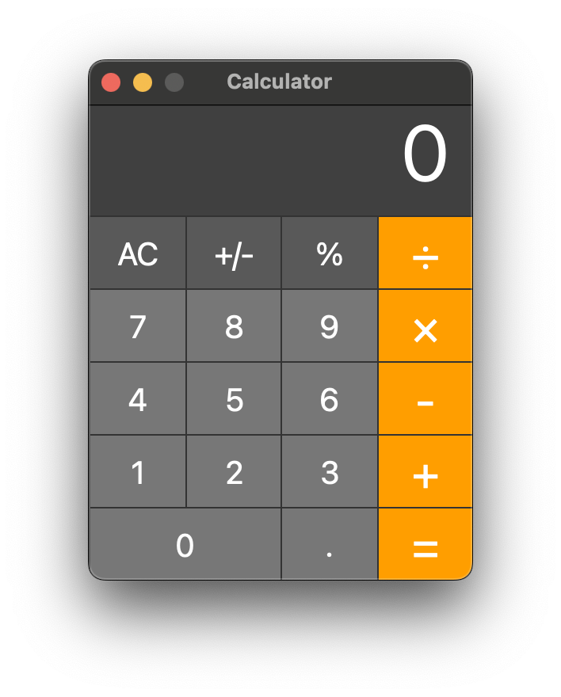

# Edifice: a declarative GUI library for Python

[](https://codecov.io/gh/fding/pyedifice)



Installation for version 0.0.10:
```
    pip install pyedifice
```

Detailed Documentation: [Read the docs](https://pyedifice.org)

Edifice is a Python library for building reactive UI, inspired by modern Javascript libraries such as React.
Edifice makes it simple to build a fully reactive UI without ever leaving Python, getting the best of both worlds:

- Modern paradigms from web development that simplify UI creation
- Fast iteration via hot reloading
- Seamless integration with the Python ecosystem (standard library, numpy, matplotlib, pandas, etc)
- A native desktop app without the overhead of bundling a browser.

Edifice uses Qt as a backend (although it could be generalized to other backends).

## Getting Started

Edifice is inspired by React, so if you have React experience, you'll find Edifice to be very similar.
For example, for the React `setState` function, Edifice has `set_state`, and for React's `this.props`,
Edifice has `self.props`.
All function names use underscores instead of camel case to conform to Python standards,
and "Component" is removed from functions like `shouldComponentUpdate` (renamed to `should_update`).

See the [tutorial](https://www.pyedifice.org/tutorial.html) to get started.

## Why Edifice?
The premise of Edifice is that
GUI designers should only need to worry about *what* is rendered on the screen,
not *how* the content is rendered.
Most existing GUI libraries in Python, such as Tkinter and Qt, operate imperatively.
To create a dynamic application using these libraries,
you must not only think about what to display to the user given state changes,
but also how to issue the commands to achieve the desired effect.

Edifice allows you to describe the GUI as a function mapping state to displayed widgets,
leaving the how to the library.
User interactions update the state, and state changes update the GUI.
Edifice makes it possible to write code like:
```
View(layout="row")(
    Button("Add 5", on_click=lambda:self.set_state(data=self.data + 5)),
    *[Label(i) for i in self.data]
)
```

and get the expected result: the values in self.data will be displayed, and clicking the button will
add 5 to the array, and this state change will automatically be reflected in the GUI.
You only need to specify what is to be displayed given the current state,
and Edifice will work to ensure that
the displayed widgets always correspond to the internal state.

Edifice is designed to make GUI applications easier for humans to reason about.
Thus, the displayed GUI always reflect the internal state,
even if an exception occurs part way through rendering ---
in that case, the state changes are unwound,
the display is unchanged,
and the exception is re-raised for the application to handle.
You can specify a batch of state changes in a transaction,
so that either all changes happen or none of them happens.
There is no in-between state for you to worry about.

Declarative UIs are also easier for developer tools to work with.
Edifice provides two key features to make development easier:

- Dynamic reloading of changed source code. This is especially useful for tweaking the looks of your application, allowing you to test if the margin should be 10px or 15px instantly without closing the app, reopening it, and waiting for everything to load.
- Component inspector. Similar to the Inspect Elements tool of a browser, the component inspector will show you all Components in your application along with the props and state, allowing you to examine the internal state of your complex component without writing a million print statements.
  Since the UI is specified as a (pure) function of state, the state you see completely describes your application,
  and you can even do things like rewinding to a previous state.


QML is another declarative GUI framework for Qt. Edifice differs from QML in these aspects:
- Edifice interfaces are created purely in Python, whereas QML is written using a separate language.
- Because Edifice interfaces are built in Python code, binding the code to the declared UI is much more
straightforward.
- Edifice makes it easy to create dynamic applications. It's easy to create, shuffle, and destroy widgets
because the interface is written in Python code. QML assumes a much more static interface.

An analogy is, QML is like HTML + JavaScript, whereas Edifice is like React.js.
While QML and HTML are both declarative UI frameworks,
they require imperative logic to add dynamism.
Edifice and React allow fully dynamic applications to be specified declaratively.

## How it works:
An Edifice component encapsulates application state and defines the mapping from the state to UI in the render function.
The state of a Component is divided into **props** and **state**.
Props are state passed to the Component in the constructor,
whereas state is the Component's own internal state.
Changes to props and state will trigger a rerender of the Component and all its children.
The old and new component trees will be compared to one another,
and a diffing algorithm will determine which components previously existed and which ones are new
(the algorithm behaves similarly to the React diff algorithm).
Components that previously existed will maintain their state, whereas their props will be updated.
Finally, Edifice will try to ensure that the minimal update commands are issued to the UI.
All this logic is handled by the library, and the Components need not care about it.

Currently, Edifice uses Qt under the hood, though it could be adapated to delegate to other imperative GUI frameworks as well.

## Development Tools

Edifices also offers a few tools to aid in development.

### set_trace
PDB does not work well with PyQt5 applications. `edifice.set_trace` is equivalent to `pdb.set_trace()`,
but it can properly pause the PyQt5 event loop
to enable use of the debugger
(users of PySide2 need not worry about this).

### Dynamic reload
One other advantage of declarative code is that it is easier for humans and machines to reason about.
Edifice takes advantage of this by offering hot reloading of Components.
When a file in your application is changed, the loader will reload all components in that file
with preserved props (since that state comes from the caller) and reset state.
Because rendering is abstracted away, it is simple to diff the UI trees and have the Edifice renderer figure out
what to do using its normal logic.

To run your application with dynamic reload, run:

`python -m edifice path/to/app.py RootComponent`.

This will run app.py with RootComponent mounted as the root.
A separate thread will listen to changes in all Python files in the directory containing `app.py` (recursing into subdirectories),
and will reload and trigger a re-render in the main thread.
You can customize which directory to listen to using the `--dir` flag.


### Component Inspector 

The Edifice component inspector shows the Component tree of your application along with the props and state of each component.

## Other information
### Contribution

Contributions are welcome; feel free to send pull requests!

### License
Edfice is MIT Licensed.

Edifice uses Qt under the hood, and both PyQt5 and PySide2 (and PySide6) are supported. Note that PyQt5 is distributed with the GPL license while PySide2 and PySide6 are distributed
under the more flexible LGPL license.
