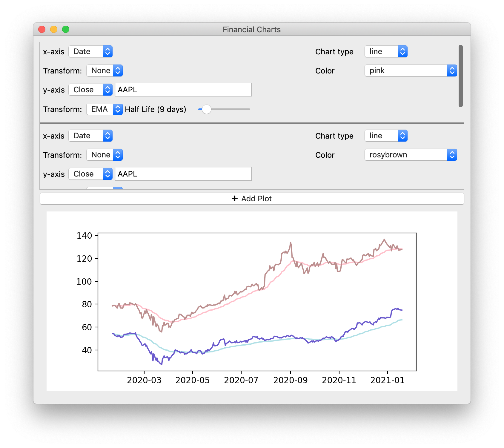
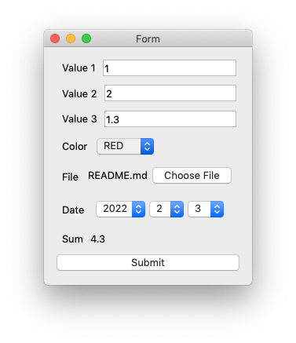

# Examples

## Calculator

File: `calculator.py`

An example application mimicking the look of the Mac OS X calculator app.
To avoid uninteresting (from the UI perspective) complexity,
the app does not support order of operations.

## Edifice vs QT

File: `example_edifice.py`, `example_qt.py`

A very simple app written in both Edifice and Qt.
Originally I planned to make a more complex app with more dynamism and reactivity,
but I didn't want to have to write that in raw Qt!

##  Financial Chart Viewer

File: `financial_charts.py`

An example to show reactivity and the benefits of having state drive the UI,
as well as builtin Matplotlib integration.

The application allows the user to plot arbitrary number of charts on the same axis.
For each chart, both x and y axis can point to any data source (date, stock price, volume) with an optional EMA transform (the half life is adjustable with a slider, and adjustments automatically update the graph).
This enables a wide spectrum of analyses, from cluster plots of two different stocks to understand their correlation, to comparing the stock price with a running average.

This application would be fairly complex to program in raw QT but takes fewer than 200 well documented lines of code (and ample whitespace) with Edifice. Most importantly, the logic is straightforward. The application state is the full list of descriptions of each plot. Each gui element displays part of the state (e.g. the x-axis of plot 0, the actual graph, etc.), and some GUI elements allow the user to change a part of the state.

## Forms

File: `form.py`

An example to show how the Form component makes creating routine UI for simple forms extremely simple.
The Form component creates input elements for data in a type specific way: for example,
strings would correspond to text inputs,
enums to dropdowns,
datetime.dates to three dropdowns (with the right number of days for each month),
etc.
You can also pass a function, which would generate a label whose content is the function evaluated on the inputs.

The Form component was created using the same high-level Edifice api provided to users,
so [its source code](https://github.com/pyedifice/pyedifice/blob/master/edifice/components/forms.py) is technically another example!

## Harmonic Oscillator

File: `harmonic_oscillator.py`

An example showing animation. The animation was rendered at 30 FPS (the GIF is only at 12 FPS so you won't be able to tell).
You can interactively set the frequency and damping factors and instantly see the result,
both in a graph and in the animation.
Python of course has great numeric libraries, so we can work with complex numbers.
